# MyCassegrainLens

# Оглавление
[**Телескопическая система Кассегрена**	3](#_toc186392603)

[**Основные характеристики**	4](#_toc186392604)

[**Преимущества**	6](#_toc186392605)

[**Недостатки и ограничения**	6](#_toc186392606)

[**Области применения**	7](#_toc186392607)

[**Расчет телескопической системы**	8](#_toc186392608)

[**Выбор окуляра**	10](#_toc186392609)

[**Выбор цифровой камеры**	11](#_toc186392610)

[**Построение чертежей оптической системы**	12](#_toc186392611)

[**Заключение**	15](#_toc186392612)

[**Список литературы**	16](#_toc186392613)

#				
#

##

# **Телескопическая система Кассегрена**
Схема была предложена [Лораном Кассегреном](https://ru.wikipedia.org/wiki/%D0%9A%D0%B0%D1%81%D1%81%D0%B5%D0%B3%D1%80%D0%B5%D0%BD,_%D0%9B%D0%BE%D1%80%D0%B0%D0%BD "Кассегрен, Лоран") в 1672 году. Это вариант двухзеркального объектива телескопа. Главное зеркало большего диаметра (вогнутое; в оригинальном варианте параболическое) отбрасывает лучи на вторичное выпуклое меньшего диаметра (обычно гиперболическое). По классификации [Максутова](https://ru.wikipedia.org/wiki/%D0%9C%D0%B0%D0%BA%D1%81%D1%83%D1%82%D0%BE%D0%B2,_%D0%94%D0%BC%D0%B8%D1%82%D1%80%D0%B8%D0%B9_%D0%94%D0%BC%D0%B8%D1%82%D1%80%D0%B8%D0%B5%D0%B2%D0%B8%D1%87 "Максутов, Дмитрий Дмитриевич") схема относится к так называемым предфокальным удлиняющим — то есть вторичное зеркало расположено между главным зеркалом и его фокусом и полное фокусное расстояние объектива больше, чем у главного. Объектив при том же диаметре и фокусном расстоянии имеет почти вдвое меньшую длину трубы и несколько меньшее экранирование, чем у Грегори. Система неапланатична, то есть несвободна от [аберрации комы](https://ru.wikipedia.org/wiki/%D0%9A%D0%BE%D0%BC%D0%B0_\(%D0%BE%D0%BF%D1%82%D0%B8%D0%BA%D0%B0\) "Кома (оптика)"). Имеет большое число как зеркальных модификаций, включая апланатичный Ричи — Кретьен, со сферической формой поверхности вторичного (Долл — Кирхем) или первичного зеркала, так и зеркально-линзовых.

Зеркальные телескопические системы образуют изображение путем отражения света от зеркальной поверхности сферической или параболической формы. Наибольшее распространение получила двухзеркальная схема Кассегрена. После отражения на главном зеркале пучок лучей попадает на вспомогательное зеркало, которое направляет его обратно – через отверстие в главном зеркале. Фокальная плоскость в этой системе располагается за оправой главного зеркала.

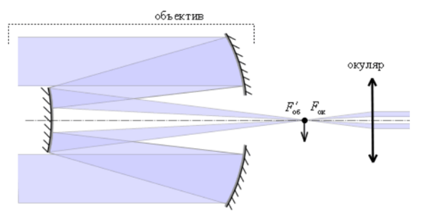

Рисунок 1. Система Кассегрена

В фокальной плоскости зеркала могут быть помещены фотопластинки для фотографирования небесных объектов или любая другая светоприемная аппаратура: спектрографы, фотометры и так далее. Изображение либо получается непосредственно на фотографической пластинке, либо исследуется визуально через окуляр.

Эта система широко применяется в телескопах, установлена она и в Большом Телескопе Азимутальном (БТА). БТА – самый большой оптический телескоп в мире (находится на Северном Кавказе) с главным зеркалом диаметром 6 метров (его вес 650 тонн). Телескоп установлен в башне высотой 53 м с диаметром купола 45,2 м. В настоящее время телескоп обеспечивает выполнение важнейших научных программ.

Расстояние от последней поверхности (от большого зеркала) до фокуса значительно меньше фокусного расстояния, поэтому длина системы Кеплера с таким объективом может быть в несколько раз короче, чем если бы использовался обычный линзовый объектив.

Для того, чтобы обеспечить как можно большее увеличение при стандартном размере выходного зрачка, необходимо применение объективов с предельно большим диаметром. Увеличение диаметра входного зрачка позволяет увеличить и светосилу, и разрешающую способность, что необходимо, скажем, для наблюдения очень слабых звезд. Технически изготовить зеркало большого диаметра легче, чем линзу, так как оптические неоднородности в толще стекла для зеркала не имеют значения, поэтому применение зеркальных систем позволяет увеличить диаметр входного зрачка, а тем самым – увеличение, светосилу и разрешающую способность телескопической системы. К тому же в зеркальных объективах хроматические аберрации намного меньше, чем в линзовых.
## **Основные характеристики**
Объектив Кассегрена характеризуется рядом параметров, определяющих его оптические свойства и качество изображения. 

Эти характеристики взаимосвязаны и влияют на итоговое качество изображения и производительность телескопа Кассегрена. При проектировании такой системы важно учитывать баланс между светосилой, разрешением, полем зрения и минимизацией аберраций.

Основные характеристики объектива Кассегрена включают:

• **Фокусное расстояние (F):** Расстояние от главного фокуса до вторичного зеркала. Определяет масштаб изображения и увеличение телескопа при использовании различных окуляров.

• **Относительное отверстие (f/D):** Отношение фокусного расстояния (F) к диаметру главного зеркала (D). Определяет светосилу телескопа (чем меньше f/D, тем светосильнее). Влияет на яркость изображения, глубина резкости и чувствительность к аберрациям.

• **Диаметр главного зеркала (D):** Определяет светособирающую способность телескопа (чем больше диаметр, тем больше света собирается). Влияет на разрешение и предел полезного увеличения.

• **Диаметр вторичного зеркала:** Влияет на светопропускание и обзор поля зрения. Обычно меньше, чем диаметр главного зеркала, для пропускания света к окуляру.

• **Тип зеркал:** Главное зеркало — параболическое, а вторичное — гиперболическое. Геометрия и точность изготовления этих поверхностей критически важны для минимизации аберраций. Отклонения от идеальной формы приводят к снижению качества изображения.

• **Центральное экранирование:** Вторичное зеркало блокирует часть света, падающего на главное зеркало. Это приводит к центральному экранированию, что уменьшает светособирающую способность, особенно в областях с высокой пространственной частотой (высокое разрешение). Степень экранирования зависит от размеров вторичного зеркала.

• **Поле зрения:** Угловой размер области пространства, которую можно наблюдать в телескопе. Ограничено размером вторичного зеркала и конструкцией системы. Может быть расширено с помощью корректоров поля.

• **Аберрации:** Остаточные оптические аберрации, которые невозможно полностью устранить в конструкциях Кассегрена. Основные типы аберраций, характерные для системы Кассегрена:
\* **Кома:** Искажение точечного источника света вне центра поля зрения.
\* **Астигматизм:** Размытие изображения из-за несовпадения фокусных плоскостей в разных меридианах.
\* **Сферическая аберрация:** Размытие изображения из-за неидеальной сферической формы зеркал. Обычно частично компенсируется формой зеркал, но полностью устранить невозможно.

• **Материал зеркал:** Обычно используется стекло с высоким коэффициентом отражения (часто с многослойными диэлектрическими покрытиями для повышения эффективности).

**Преимущества**

• **Компактность:** Система Кассегрена значительно короче, чем ньютоновский телескоп с тем же фокусным расстоянием. Это делает её более удобной для транспортировки и установки. Свет отражается дважды, что позволяет разместить фокус в месте, доступном для окуляра.

• **Фокус находится сзади:** Доступ к фокальной плоскости расположен сзади, что облегчает установку различных аксессуаров, таких как окуляры, фотокамеры, спектрографы и т. д.

• **Хорошая коррекция аберраций:** Хотя полностью устранить аберрации невозможно, конструкция Кассегрена позволяет частично компенсировать сферическую аберрацию и кому. Это улучшает качество изображения по сравнению с простыми ньютоновскими системами. Применение дополнительных корректоров может дополнительно улучшить качество изображения.

• **Высокое разрешение:** Благодаря относительно большому диаметру главного зеркала, телескопы Кассегрена способны на высокое угловое разрешение.

• **Высокая светосила (в некоторых вариантах):** В зависимости от соотношения фокусных расстояний зеркал, система Кассегрена может быть довольно светосильной, что важно для наблюдения слабых объектов.

**Недостатки и ограничения**

• **Центральное экранирование:** Вторичное зеркало неизбежно перекрывает часть света, поступающего на главное зеркало, снижая светособирающую способность, особенно на высоких пространственных частотах. Это может ухудшать контрастность изображения и приводить к появлению дифракционных эффектов.

• **Сложность изготовления:** Изготовление гиперболического вторичного зеркала требует высокой точности и является более сложным, чем изготовление параболического главного зеркала.

• **Необходимость коррекции:** Для достижения высокого качества изображения часто требуется применение корректоров для компенсации остаточных аберраций. Для того чтобы в нашей системе скорректировать аберрации, мы установили мениск перед объективом Кассегрена.

**Области применения**

Благодаря своим особенностям, телескопы Кассегрена широко используются в различных областях:

• **Астрономические наблюдения:** Для визуальных наблюдений планет, Луны, звездных скоплений и галактик.

• **Астрофотография:** Благодаря компактному дизайну и удобному доступу к фокусной плоскости, они часто используются для получения высококачественных изображений небесных объектов.

• **Наземные телескопы среднего и большого диаметра:** Кассегреновская схема применяется во многих крупных наземных телескопах благодаря своей компактности и относительно хорошей коррекции аберраций.

• **Космические телескопы:** Используются в некоторых космических телескопах из-за компактности и возможности хорошего качества изображения.

• **Лазерные системы:** Используются в некоторых лазерных системах для создания коллимированных и фокусированных лучей.

#

#

# **Расчет телескопической системы**

Исходные данные:

• Коэффициент экранирования  η≤0.25

• Расстояние от главного зеркала до фокуса  δ=0.3м

• Угол поля зрения объектива  2ω=0.15°

• Относительное отверстие объектива 1 : 5

• Диапазон длин волн – видимый

• Телескоп должен работать в двух режимах: визуальном и фотографическом

• Для визуального режима подобрать соответствующий окуляр, для фотографического – цифровую камеру

• Требования к качеству изображения: постараться добиться дифракционного качества изображения по 40 – 60 % поля зрения

`                  `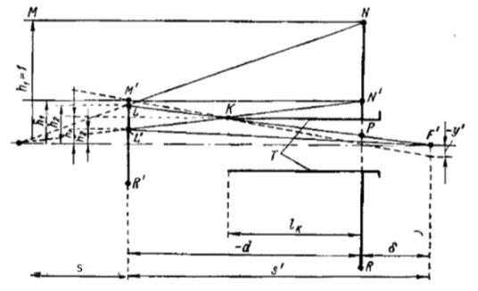

Рисунок *2*. Схема *для габаритного расчета системы*

В процессе разработки оптической системы телескопа, на начальном этапе была выявлена аберрация комы. Кома – это аберрация третьего порядка, которая возникает из-за несимметричного преломления и отражения световых лучей, проходящих через оптическую систему. В результате такой аберрации изображение точечного источника света получается в виде размытого пятна, напоминающего комету, с характерным "хвостом", направленным от центра поля зрения. Это приводит к искажению формы звездных объектов и снижению четкости изображения, особенно в периферийных частях поля зрения.

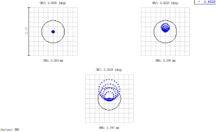

Рисунок *3*. Точечная диаграмма до коррекции аберрации

Для того чтобы скорректировать аберрацию комы было решено использовать мениск, который мы поставили перед объективом Кассегрена.

Теперь, после коррекции, основная часть энергии пучка света концентрируется в пределах диска Эйри. 

Диск Эйри – это дифракционный предел разрешения для оптической системы с круглой апертурой. Он представляет собой центральное пятно и окружающие его дифракционные кольца, формируемые в результате дифракции света на апертуре телескопа. Скорректированная система позволяет добиться дифракционного предела и эффективно собирает энергию в центре пятна.  

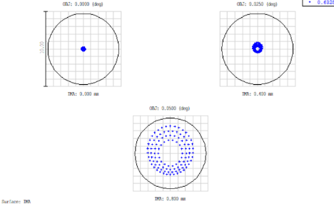

`                             `Рисунок *4*. Точечная диаграмма после коррекции аберрации

Превышение размера пучка на выходе за диск Эйри означало бы, что аберрации преобладают над дифракционными эффектами, и качество изображения значительно снижается. Однако, скорректировав кому, мы добились того, что диаметр пучка на выходе приближается к теоретическому дифракционному пределу (диску Эйри), который определяется диаметром апертуры и длиной волны света. Это значит, что разрешение оптической системы стало максимально возможным в соответствии с ее параметрами.

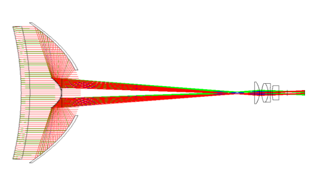Рисунок 5. Схема телескопической системы после оптимизации

## **Выбор окуляра**
В программе Lensview подобрали окуляр, наиболее соответствующий нашим параметрам (β = 0,075; относительное отверстие  15).

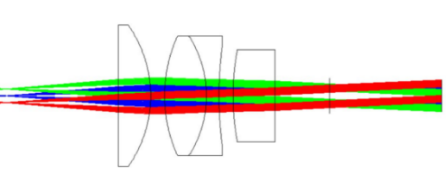

Рисунок 6. Схема окуляра

## **Выбор цифровой камеры**

Размер пикселя 2.4 мкм: Подойдет для наблюдений с высоким разрешением и увеличением, когда требуется уловить мелкие детали

1\. Выбираете камеру с размером пикселя 2.4 мкм. 

2\. Масштаб изображения = (2.4 мкм / 221.458 мм) × 206.265 ≈ 2.24 угловых секунды на пиксель.

Угол поля зрения 0.15 градуса - это 0.0026 радианов.

Размер матрицы должен соответствовать, чтобы поле зрения соответствовало заданному значению.   

Размер матрицы должен быть равен: 0.0026 × 221.458 = 0.57 мм.   

Это значит, что матрица должна быть достаточно большой, чтобы покрывать этот размер.

Количество пикселей должно быть около 0,57 мм / 2.4 мкм ≈ 237

Для телескопа с f/5, фокусным расстоянием 221,458 мм, с малым размером пикселя (2,4 мкм) и достаточно малой матрицей,  а так же учитывая узкое поле зрения телескопа, лучше всего подойдет камера с монохромной матрицей типа CMOS, такая как ZWO ASI178MM.

`                                 `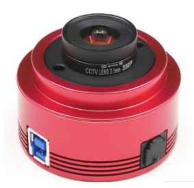

## **Построение чертежей оптической системы**

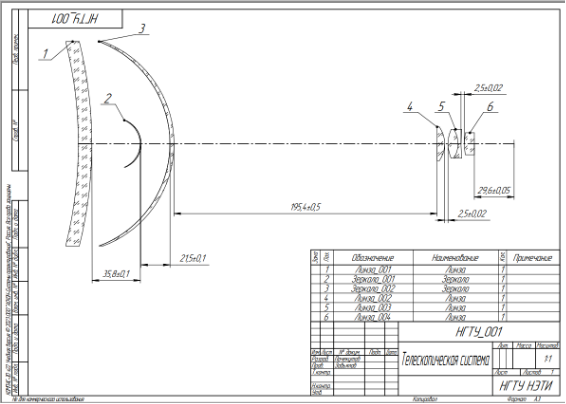
Рисунок 7. Чертеж полной оптической системы.

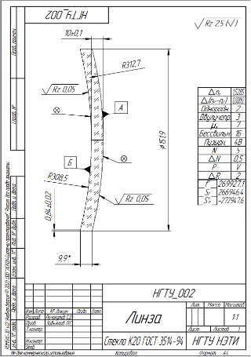

Рисунок 8. Чертеж Линзы\_001

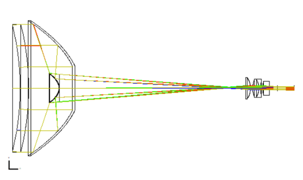

Рисунок 9. Схема телескопической системы

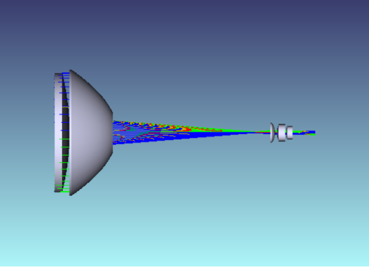

Рисунок 10. Схема телескопической системы

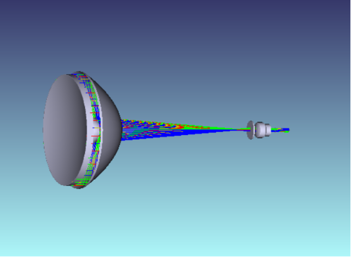

Рисунок 11. Схема телескопической системы

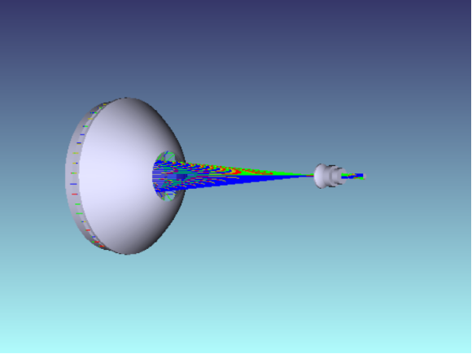

Рисунок 12. Схема телескопической системы
# **Заключение**
В данной курсовой мы рассмотрели телескопическую систему с объективом Кассегрена, его особенности и способы применения. Был произведен габаритный расчёт системы, по которому была составлена оптическая схема установки. В программе Lensview под исходные данные мы подобрали окуляр. Также была выбрана цифровая камера для фотографического режима. Был сделан чертеж оптической системы и отдельной линзы.
#
#
#
#

#

# **Список литературы**
1. Е. С. Жимулева, П. С. Завьялов, М. С. Кравченко, «Разработка телецентрических объективов для систем размерного контроля»;
1. https://delta-design.ru/stati/17247-telecentricheskiy-obektiv.html;
1. Е.С.Жимулева, «Разработка и создание оптико-электронных теневых проекционных систем для размеренного контроля трёхмерных объектов с повышенной точностью в промышленном произведстве».
1. https://planetarium.ru/product/tsifrovaya-kamera-zwo-asi178mm-monokhromnaya/?srsltid=AfmBOoo2X8ilmWY2GGVvqc6nEPj-qK-jtvH0yTmxhGIFPTP5Nok46xVa

